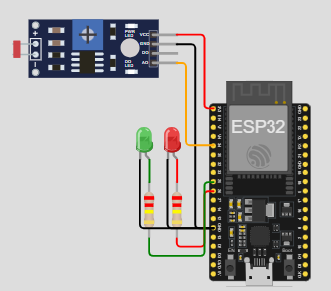

# DISRUPTIVE ARCHITECTURES: IOT, IOB & GENERATIVE IA
# Grupo Sol Rural - Projeto: Energia Agrovoltaica 
Luiza Nunes de Jesus - RM99768  
Melissa de Oliveira Pecoraro - RM98698  
Pamella Schimalesky Engholm- RM551600  
Roberto Menezes Dos Santos - RM552520
## Indíce
1. [Visão Geral](#1-visão-geral)
2. [Tecnologias Utilizadas](#2-tecnologias-utilizadas)
3. [Pré-requisitos](#3-pré-requisitos)
4. [Configuração do Hardware](#4-configuração-do-hardware)
5. [Configuração do Software](#5-configuração-do-software)
6. [Como Executar](#6-como-executar)
7. [Testando a Solução](#7-testando-a-solução)
   
### 1. Visão Geral
O projeto "Energia Agrovoltaica" propõe uma solução inovadora para os desafios de escassez de energia e água no semiárido do Nordeste do Brasil. Esta região enfrenta dificuldades econômicas e sociais, com a escassez de recursos essenciais impactando diretamente a agricultura local. O objetivo do projeto é utilizar energia solar, uma fonte limpa e acessível, para promover o desenvolvimento sustentável em comunidades agrícolas, principalmente nas regiões do Sertão, onde a falta de energia elétrica e água potável é um obstáculo contínuo. A proposta envolve a criação de uma plataforma inteligente de monitoramento e controle de geração de energia solar, utilizando IoT para otimizar a utilização de energia solar e aumentar a eficiência das atividades agrícolas.

O sistema consiste em:

- **Monitoramento de luminosidade** (simulação de painel solar).  
- **Indicação visual da energia gerada usando LEDs** (verde e vermelho).  
- **Dashboard online para acompanhamento em tempo real.**

### 2. Tecnologias Utilizadas
**Hardware:**

- ESP32 (para funcionalidades Wi-Fi).
- Sensor LDR (Light Dependent Resistor).
- LEDs (verde e vermelho).

**Software:**

- Simluador Wokwi.  
- Node-red

### 3. Pré-requisitos
Antes de começar, você precisa ter o seguinte instalado:

- Node-red.

### 4. Configuração do Hardware

- Monte o circuito básico de acordo com a imagem:
- 
- Conecte o sensor LDR e os LEDs aos pinos que estão difinidos no código em C++ utilizado no Wokwi.
- Use resistores apropriados para proteger os LEDs.

### 5. Configuração do Software
Simulador Wokwi:
- Abra o Wokwi e utlize o código disponibilizado no arquivo: 'gs_iot.txt' ou em https://wokwi.com/projects/415014033472508929.

Dashboard(Node-red):
- No cmd rode 'node-red' e confirme que ele está instalado para ser utilizado.

### 6. Como Executar
- Certifique-se de que o hardware está montado corretamente e o código no Wokwi foi carregado.
- Rode o código em C++ no Wokwi.
- Rode 'node-red' e com o localhost já aberto, cole o json do fluxo de nós desse projeto disponível em: 'gs_iot.json' e confira na foto também disponilizada.
- Com conexões ao broker sendo feita, no debug aparecerá as mensagens enviadas do Wokwi.
- Acesse o dashboard com 'localhost/ui' no navegador para visualizar os dados em tempo real.

### 7. Testando a Solução

- Ajuste a intensidade de luz no sensor LDR do Wokwi para testar o comportamento do sistema.
- Acesse o node-red e o dashboard enquanto muda a intensidade da luz no LDR.
- Verifique se os gráficos atualizam em tempo real.
- Envie mensagens pelo 'Feedback' no Dashborad e confira se as mensagens chegam no node-red e no wokwi.
- Verifique se o led acende conforme a mensagem enviada via mqtt out pelo node-red.
